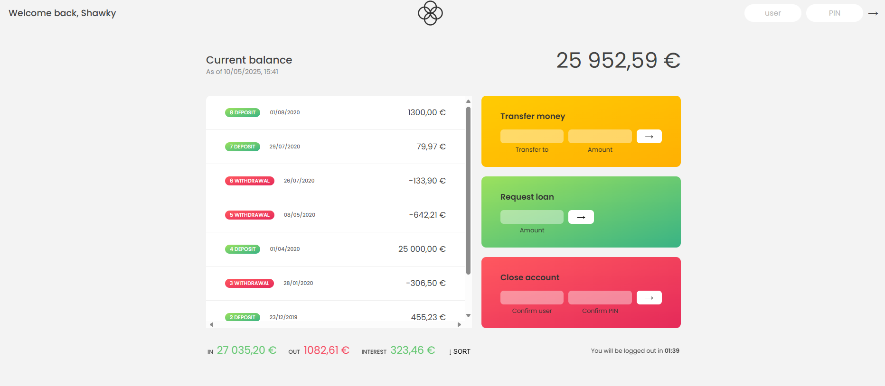

# Bankist App

A minimalist banking application built with vanilla JavaScript. This project demonstrates advanced DOM manipulation, array methods, and modern JavaScript features.

## Features

- **User Authentication:** Simple PIN-based login system
- **Transaction History:** View detailed transaction history with dates
- **Money Transfers:** Transfer money between accounts
- **Loan Requests:** Request loans based on deposit history
- **Account Closure:** Close account functionality
- **Auto Logout:** Timer-based automatic logout
- **Balance Calculation:** Real-time balance and transaction summaries
- **Transaction Sorting:** Sort transactions by amount

## Technologies Used

- **HTML5**
- **CSS3**
- **Vanilla JavaScript (ES6+)**

## Live Demo

Check out the live version of the Bankist App: [View Demo](https://qs3h.github.io/Bankist-Application/)

## Getting Started

1. **Clone the repository:**

   ```bash
   git clone <your-repo-url>
   cd Bankist-App
   ```

2. **Open the project:**
   - Open `index.html` in your browser
   - Or use a live server extension in your code editor

## Test Account Credentials

To try the app, use these test accounts:

- User: `sa` PIN: `1111`
- User: `jd` PIN: `2222`

## Features Demonstrated

- **Array Methods:** map, filter, reduce, find, some, every, etc.
- **Numbers & Dates:** Intl API for formatting
- **Timers:** setTimeout and setInterval
- **DOM Manipulation:** Event handling and UI updates
- **Modern JavaScript:** Destructuring, optional chaining, etc.

## Screenshots

The application features a clean, modern interface for banking operations:

- Balance overview
- Transaction history
- Transfer functionality
- Loan requests
- Account management



## Learning Outcomes

- Advanced array manipulation in JavaScript
- Working with dates and timers
- Implementing login/logout functionality
- Managing financial calculations
- Building responsive user interfaces

---

Feel free to fork, contribute, or reach out if you have questions!
